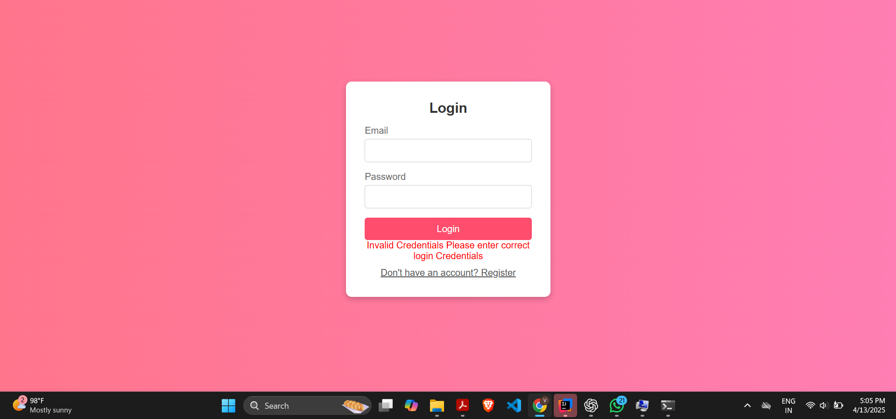
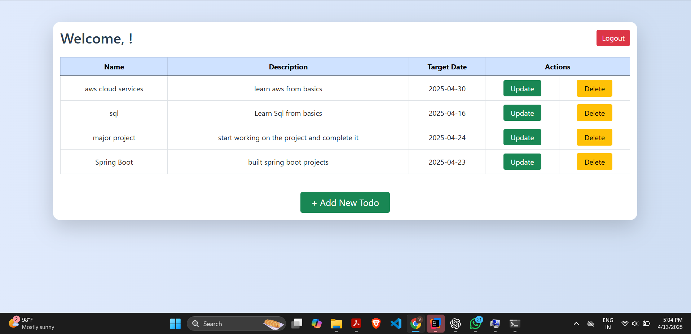
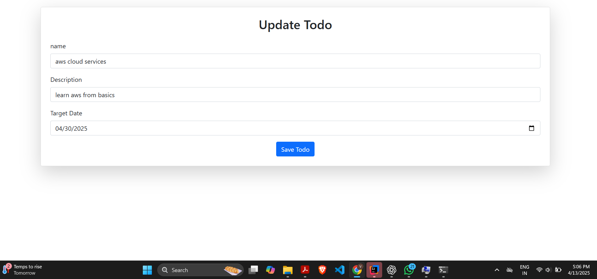
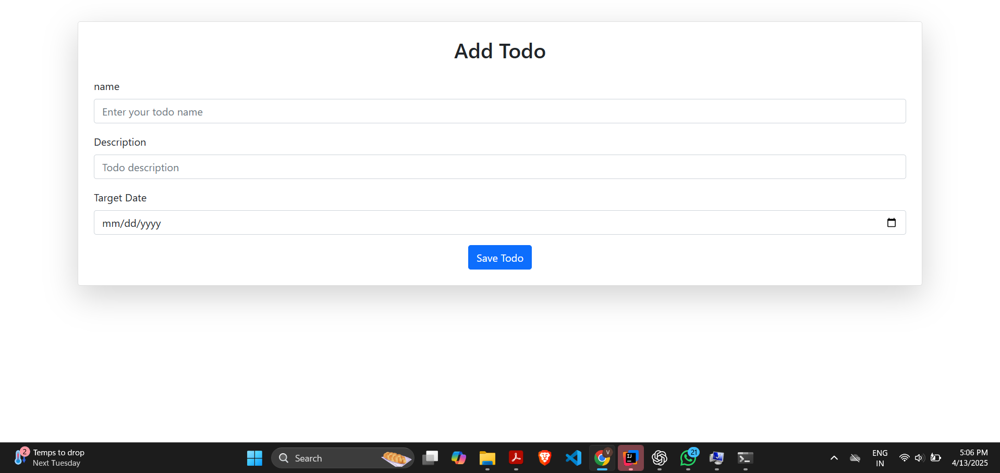

# Task Management / Todo Application

## Project Overview

This is a Task Management (Todo) application built using **Spring Boot**, **Thymeleaf**, and **MySQL**. The application allows users to:

- **Login** and **Logout** securely.
- **Add**, **Update**, and **Delete** tasks (Todos).
- Store and retrieve task data from a **MySQL** database.

## Technologies Used

- **Spring Boot**: A Java framework to build the backend.
- **Thymeleaf**: A templating engine used to render the frontend.
- **MySQL**: Database to store user and task data.
- **Java 8+**: The programming language used.

## Features

- **User Authentication**: Users can register, login, and log out.
- **Task Management**: Add, update, and delete tasks.
- **Responsive UI**: View and manage tasks through a user-friendly web interface.

## Requirements

- **JDK 8 or later**
- **Maven** (for managing dependencies and building the project)
- **MySQL Database** with a configured database for storing user and task data.

### Screenshots

Here are some screenshots of the application:

